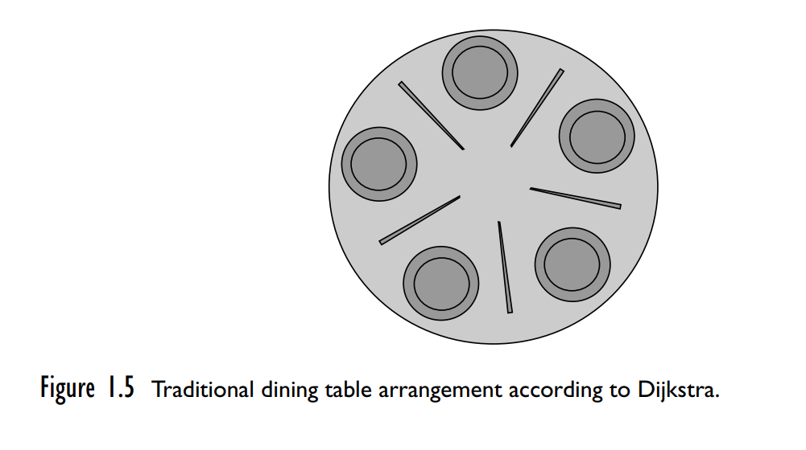
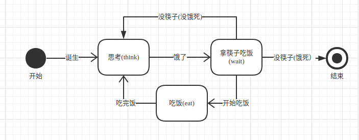
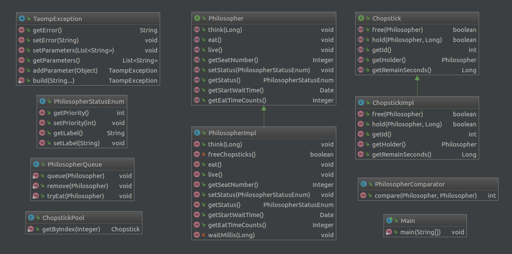

**Exercise 1.** 哲学家就餐的问题是由并发先驱E. W. Dijkstra发明的，旨在澄清死锁(dead-lock)和饥饿自由(starvation freedom)的概念。 想象一下五个哲学家，他们终其一生只是在思考和就餐。 他们坐在一张带五把椅子的圆桌旁。 每个位置前面有一大盘米饭。 但是，只有五根筷子（在原文中说的是刀叉）可用，如图1.5所示。 每个哲学家都在思考。 当他饿了，他坐下来拿起最接近他的两根筷子。 如果一个哲学家可以拿起两根筷子，他可以吃一段时间。 在一位哲学家吃完之后，他放下筷子再次开始思考。

1. 编写一个程序来模拟哲学家的行为，每个哲学家都是一个线程，筷子是共享对象。 请注意，您必须防止两位哲学家同时持有相同筷子的情况。
2. 修改你的程序，使其永远不会达到哲学家陷入僵局的状态(deadlocked status)，也就是说，每个哲学家都持有一根筷子并且等待拿到第二根筷子的情况永远不会发生。
3. 修改你的程序，以免任何哲学家挨饿。
4. 编写一个程序，为任何数量的哲学家提供饥饿自由(starvation-free)的解决方案。

## 问题分析
1. 以免任何哲学家挨饿，就是说不能让哲学家饿死，我需要设置一个时间变量，记录哲学家挨饿的时间。
2. 需要根据哲学家的挨饿时间决定谁先用餐，挨饿最久的先用餐。
3. 为了提高筷子的利用率，当一个哲学家就餐时，做旁边的哲学家可以询问他还需要就餐多久，以决定自己再次思考的时间。哲学家争分夺秒地思考人生。
4. 请注意，您必须防止两位哲学家同时持有相同筷子的情况。意味着：程序里面，遇到这个情况要抛异常，终止程序。
5. 哲学家终其一生只是在思考和就餐。需要设置哲学家的状态：思考(THINKING),思考结束后等待就餐(WAITING),就餐(EATING). 在等待的时候，如果筷子可以用，就进入就餐状态(EATING),如果筷子不可用，就只能继续思考。如果就餐完毕，就把筷子放下进入思考状态。

上一张类图，然后直接看代码吧:

